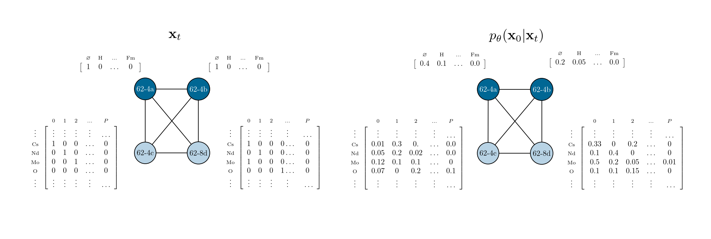

# WyckoffDiff


This is the offical public repository for the ICML 2025 paper [_WyckoffDiff -- A Generative Diffusion Model for Crystal Symmetry_](https://arxiv.org/abs/2502.06485) by Filip Ekström Kelvinius, Oskar B. Andersson, Abhijith S. Parackal, Dong Qian, Rickard Armiento, and Fredrik Lindsten. See [Citation](#citation) for how to cite this work.

## Data
The code already supports the dataset used in the paper (WBM), in addition to MP20 and Carbon24. Download is automatic, and using the codebase **does not require any manual download**. Please see the [data README](data/README.md) for more information on the data.

## Installation
See [INSTALL.md](INSTALL.md) for instructions on how to install required packages

## Usage
### Train
To train a WyckoffDiff model on WBM, a minimal example is
```
python main.py --mode train_d3pm --d3pm_transition [uniform/marginal/zeros_init] --logger [none/model_only/local_only/tensorboard/wandb]
```
Warning: using logger ```none``` will not save any checkpoints (or anything else), but can be used for, e.g., debugging.

This command will use the default values for all other parameters, which are the ones used in the paper.

### Generate
To generate new data, a minimal example is
```
python main.py --mode generate --num_samples [num_samples] --load [path/to/parameters.pt]
```

### Parse generated data
To convert generated data to protostructures and prototypes, run
```
python main.py --mode post_process --enrich_data --save_protostructures --load [path/to/checkpoint/dir]
```
## Questions and issues
If you have any questions or issues, please feel free to open an issue, or send an email to any of the authors (contact information in the paper).

## Citation
If you have used this code, please cite the WyckoffDiff paper
```
@inproceedings{
      kelvinius2025wyckoffdiff,
      title={WyckoffDiff -- A Generative Diffusion Model for Crystal Symmetry},
      author={Filip Ekstr{\"o}m Kelvinius and Oskar B. Andersson and Abhijith S Parackal and Dong Qian and Rickard Armiento and Fredrik Lindsten},
      booktitle={Forty-second International Conference on Machine Learning},
      year={2025},
      url={https://openreview.net/forum?id=OHPBPveXdg}
}
```

## License
This code is primarily licensed with the MIT License available in the file [`LICENSE`](LICENSE). The parts under [`wyckoff_generation/models/d3pm`](wyckoff_generation/models/d3pm) are based on the official public D3PM implementation <https://github.com/google-research/google-research/tree/master/d3pm> and therefore licensed separately under the Apache 2.0 license available at [`wyckoff_generation/models/d3pm/LICENSE.txt`](wyckoff_generation/models/d3pm/LICENSE.txt).
